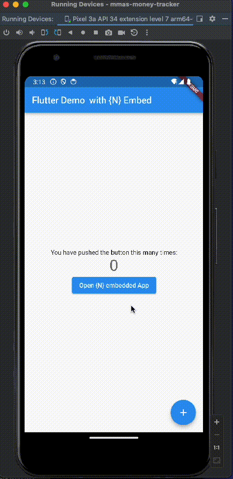

# Embedding in Flutter a Nativescript application

## Android



### Create your {N} application

1. Create application with `ns create`
2. Do your magic
3. `ns prepare android`


### Embed in your flutter application

1. (`flutter create test`) 
2. Copy the contents from `{N}/platforms/android/app/src/main/assets/app` to `<flutterapp>/android/app/src/main/assets/public/app`
3. Update your flutter MainActivity to have a methodChannel
```kotlin
 package com.example.fluttertest

import android.content.Context;
import io.flutter.embedding.android.FlutterActivity
import io.flutter.embedding.engine.FlutterEngine
import io.flutter.plugin.common.MethodChannel
import androidx.annotation.NonNull
import com.tns.Runtime
import com.tns.RuntimeHelper
import java.io.File
import android.util.Log
import android.content.Intent

class MainActivity : FlutterActivity() {
    private val CHANNEL = "com.runtime.nsruntime"

    override fun configureFlutterEngine(@NonNull flutterEngine: FlutterEngine) {
        super.configureFlutterEngine(flutterEngine)

        MethodChannel(flutterEngine.dartExecutor.binaryMessenger, CHANNEL).setMethodCallHandler {
                call,
                result ->
            // This method is invoked on the main thread.
            // TODO
            if (call.method == "loadEmbeddedNS") {
                val ctx : Context = getApplicationContext()
                var appDir = ctx.getFilesDir()
                appDir = appDir.getCanonicalFile()

                var rt : com.tns.Runtime = RuntimeHelper.initRuntime(ctx)
                Log.v("HELLO", "Attempting To start file")
                Log.v("HELLO", appDir.toString())

                if (rt != null) {

                    val file = File(appDir, "/public/app/bundle.js")
                    Log.v("HELLO", file.exists().toString())

                    if (file.exists()) {
                        rt.runModule(file)
                    }
                }
                val intent: android.content.Intent = Intent(
                    this@MainActivity,
                    com.tns.NativeScriptActivity::class.java
                )
                intent.setAction(android.content.Intent.ACTION_DEFAULT)
                startActivity(intent)

                result.success("Android " + android.os.Build.VERSION.RELEASE);
            }
        }
    }

}
```
4. Add to your AndroidManifest.xml

```xml
<activity android:name="com.tns.NativeScriptActivity" android:theme="@style/AppTheme" />
<activity android:name="com.tns.ErrorReportActivity" />
```

5. Add to `values/styles.xml`

```xml
<style name="AppTheme" parent="Theme.AppCompat">
    <!-- Other style attributes -->
</style>
```

6. In your application create communication to the Method Channel. See [fluttertest/lib/plugin folder](fluttertest/lib/plugin)

7. Initialiase your Method channel in your dart file 
```dart
final $ns = NSRuntime();

// Platform messages are asynchronous, so we initialize in an async method.
  Future<void> loadEmbeddedApp() async {
    String response;
    // Platform messages may fail, so we use a try/catch PlatformException.
    // We also handle the message potentially returning null.
    try {
      print("Open Nativescript");
      response =
          await $ns.loadEmbeddedNS() ?? 'Unknown embedded app';
    } on PlatformException {
      response = 'Failed to load embedded app.';
    }

    // If the widget was removed from the tree while the asynchronous platform
    // message was in flight, we want to discard the reply rather than calling
    // setState to update our non-existent appearance.
    if (!mounted) return;

    debugPrint('{N}: $response');

  }
```
8. Call the function `loadEmbeddedApp()`

### Embedding Nativescript

The `commons` folder contains a script which copies the necessary build components so that Nativescript can work. 

1. Navigate to the `./commons` folder. 
2. Run `npm install`
3. Run `npm run start`
4. Give the relative path to your flutter application
5. Indicate the action as an `install`. (uninstall is to revert the file copying)

Note: for some reason if the app is clean, there is an issue with `nativescript.build.gradle` on lines 603-605. comment them out on first build and then uncomment. This works 🤷🏽‍♂️

### Run Flutter


## iOS

`TODO`


### Credits
Credit goes to these two geniuses :)

1. [@triniwiz](https://github.com/triniwiz) 
2. [@NathanWalker](https://github.com/NathanWalker)

### References

- https://blog.nativescript.org/embed-nativescript-sdk-ios/
- https://v7.docs.nativescript.org/runtimes/android/- advanced-topics/extend-application-activity
https://github.com/NativeScript/capacitor
